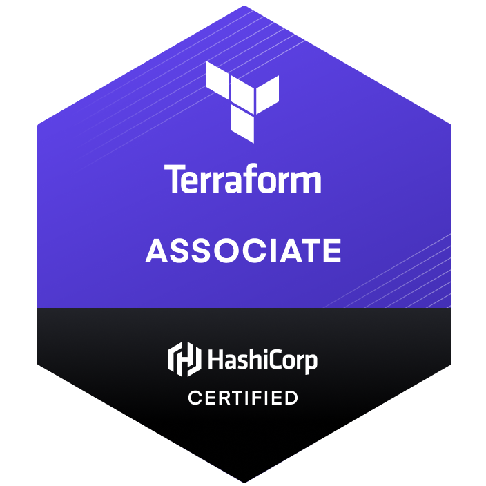

  
  

    
    
  

  
  <h1>
    hey there
    
  </h1>

  

---

### :technologist: About Me :

I am a DevOps engineer  from France.

Who am I? A real tech enthusiast!

Animated by these subjects I love to practice, share and incite to practice 😊 Through live coding sessions and lively presentations I try to transmit my joy, energy and cool things of the development world.

I regularly keep myself informed about what is going on in the world of hardware and software.

Thus, keeping an eye on technology, self-training, finding solutions even outside the framework of already acquired skills, are concepts that define me and that tend to make me a significant asset for the company.

  &nbsp;
  

---

### :mortar_board: Certificates :

  
  
  
  
  

---

### :hammer_and_wrench: Languages and Tools :

  &nbsp;
  &nbsp;
  &nbsp;
  &nbsp;
  &nbsp;

  &nbsp;
  &nbsp;
  &nbsp;
  &nbsp;
  &nbsp;
  &nbsp;
  
  &nbsp;
  &nbsp;
  
  &nbsp;
  &nbsp;

---

### :fire: My Stats :

